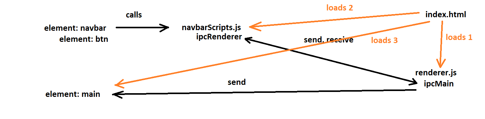

* when handling promises: when you are expecting a promise to be returned, use a setTimeout function to handle it then <do something>

* menubar functions can use ipcRenderer.emit() to trigger ipc events

* ipcRenderer should only focus on data retrieval and presentation

* ipcMain should handle data processing and passing data around ipRenderers

* any element that needs to be bounded to- and can be bounded directly to- an ipcRenderer should be done so

* any script that is passed to the renderer to alter a certain element should only be added ONCE!
  
  * e.g. settingsScripts, rankScripts, **Scripts, etc.

* any element that is passed to the renderer to alter a certain element should only be added ONCE and handled via HIDDEN attribute. 

  * e.g. settings.ejs, rank.ejs, **.ejs, etc.

* templates can be used. one example is by using ejs.

* JS LOADING and IPC FLOW:

* TODO

* [ ] Settings

    * [ ] HTML: Save Button

* [ ] Preview
    * [ ] HTML: Fix layout
